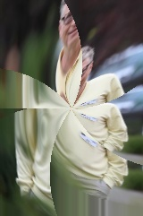
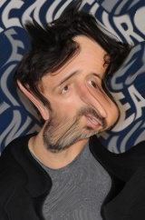
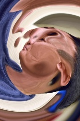

# DigiDark

**DigiDark** is an image editor inspired by *Popi* (Portable Pico), described
in the classical book
[Beyond Photography: The Digital Darkroom](http://spinroot.com/pico/)
by Gerard J. Holzmann.

DigiDark lets you apply arbitrary transformations on images. Have fun distorting
pictures.

## Example

The following code rotates an image by 180 degrees

	import digidark.interpreter
	
	ddi = digidark.interpreter.Interpreter()
	
	ddi.load('images/foo.jpg', sampling='bilinear')
	ddi.eval('new[x, y] = old[rect(r, a + rad(180))]')
	ddi.save('images/upsidedown-foo.jpg')

## Predefined Variables

Note: the origin of polar coordinates is at the center of the image. The origin of the
rectangular coordinates is at the top-left corner of the image.

**old**: original image

**new**: transformed image

**x**: current pixel's x in rectangular coordinates

**y**: current pixel's y in rectangular coordinates

**r**: current pixel's radius in polar coordinates

**a**: current pixel's angle (in radians) in polar coordinates

**R**: Half-length of image diagonal

**cx**: x of center of image rectangular coordinates

**cy**: y of center of image rectangular coordinates

## Available functions

**rect(r, a) -> (x, y)**: Polar to rectangular coordinates

**polar(x, y) -> (r, a)**: Rectangular to polar coordinates

**sin(x)**: Sine function

**avg(p)**: Gray level of pixel

## Catalogue of Transformations

Most of the following transformations were taken from Beyond Photography:
The Digital Darkroom

###  Twist
	new[x, y] = old[rect(r, a - r / 50)]

###  Bath
	new[x, y] = old[x + (x % 32) - 16, y]

###  Wave
	new[x, y] = old[x + 10 * sin(rad(y) * 10), y]

### Funhouse
	new[x, y] = old[x + sin(rad(x)) * 150, y + sin(rad(y * 1.18)) * 89]

###  Pond
	new[x, y] = old[x, y + 10 * sin(rad(y) * 10)]

### Negative
	new[x, y] = Z - old[x, y]

###  Spiralbath
	new[x, y] = old[x, y + (deg(a) + r / 4) % 64 - 16]

###  Fisheye
	new[x, y] = old[rect(1.5 * r ** 2 / R, a)]

###  Caricature
	new[x, y] = old[rect(0.5 * sqrt(r * R), a)]

### Curly
	new[x, y] = old[x + 10 * sin(rad(y) * 5), y + 10 * sin(rad(x) * 5)]

###  Sink
	new[x, y] = old[rect(r + 10 * sin(rad(r) * 10), a - r / 50)]

### T2000
	new[x, y] = old[rect(1.5 * r ** 2 / R + 10 * sin(rad(r) * 10), a)]

### Pixel
	new[x, y] = old[int(x / 10) * 10, int(y / 10) * 10]

###  Bentley
	new[x, y - avg(old[x, y]) * 0.1] = old[x, y]

