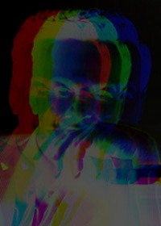
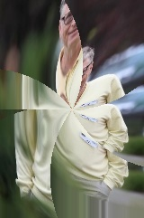

# Darko

**Darko** is an interpreter of image transformations inspired by *Popi* (Portable Pico), described
in the classical book
[Beyond Photography: The Digital Darkroom](http://spinroot.com/pico/) by 
[Gerard J. Holzmann](https://en.wikipedia.org/wiki/Gerard_J._Holzmann).

Have fun distorting some pictures with one-liners, and feel free to contribute to this project.

## Content

- [How to Run It](#how-to-run-it)
- [A Tutorial of Sorts](#a-tutorial-of-sorts) 
- [A Catalogue of Transformations](#a-catalogue-of-transformations) 

## How to Run It

**Darko** is written in Python. To run it you need to install [numpy](http://www.scipy.org/scipylib/download.html) and [OpenCV](opencv.org/downloads.html). Last time it was tried with Python 3.7.6, but any Python 3 version should work. 

```
$ pip install SimpleParse
$ pip install opencv-python
```

### Run Demo

You can run a demo that generates all images shown in the [Catalogue of Transformations](#a-catalogue-of-transformations)
by doing:

```
$ python darko.py
```

### Run Darko Grammar Test

```
python -m pytest tests
```

## A Tutorial of Sorts

Let's apply some transformations on the following picture of scientist/physics-professor/safe-cracker/bongos-player/nobel-laureate extraordinaire [Richard Feynman](https://en.wikipedia.org/wiki/Richard_Feynman).


Getting darko ready and loading the image

	import darko.interpreter
	
	# Create an interpreter
	ddi = darko.interpreter.Interpreter()
	
	# Load an image, and reads subpixels with bilinear interpolation
	ddi.load('feynman.jpg', sampling='bilinear')

Rotating the image by 45 degrees

	# Apply the transformation
	ddi.eval('new[x, y] = old[rect(r, a + rad(45))]')
	# Save result to a file
	ddi.save('feynman-rotated.jpg')


Zooming-in on the image

	ddi.eval('new[x, y] = old[rect(r / 2, a)]')
	ddi.save('feynman-zoomed.jpg')


Mirroring and translating the image

	ddi.eval('new[x, y] = old[abs(X / 2 - x), y]')
	ddi.save('feynman-mirrored.jpg')


Thresholding the image in 2-pixel blocks

	transformation = """
	    new[x, y] = gray(old[floor(x / 2) * 2, floor(y / 2) * 2]) > 150 ?
    	    rgb(255, 255, 255) : rgb(0, 0, 0)
	"""
	ddi.eval(transformation)
	ddi.save('feynman-icon.jpg')


A Warhol-like mosaic

  	transformation = """
	    new[x, y] =
    	        old[x % (X / 2) * 2, y % (Y / 2) * 2] *
                    ((x < X / 2 ?
                     (y < Y / 2 ? rgb(255, 0, 0) : rgb(0, 255, 0)) :
                     (y < Y / 2 ? rgb(255, 255, 0) : rgb(0, 255, 255))) / Z)
	"""
	ddi.eval(transformation)
	ddi.save('feynman-mosaic.jpg')


A funky late 60s or early 70s look

	transformation = """
	    new[x, y] =
	        0.33 * ((gray(Z - old[x - 25, y]) / Z) * rgb(0, 0, 255)) +
    	        0.33 * ((gray(Z - old[x, y]) / Z) * rgb(0, 255, 0)) +
    	        0.33 * ((gray(Z - old[x + 25, y]) / Z) * rgb(255, 0, 0))
	"""
	ddi.eval(transformation)
	ddi.save('docs/images/feynman-lsd.jpg')



## Predefined Variables

Note: the origin of polar coordinates is at the center of the image. The origin of the
rectangular coordinates is at the top-left corner of the image.

**old**: original image

**new**: transformed image

**x**: current pixel's x in rectangular coordinates

**y**: current pixel's y in rectangular coordinates

**r**: current pixel's radius in polar coordinates

**a**: current pixel's angle (in radians) in polar coordinates

**cx**: x of center of image rectangular coordinates

**cy**: y of center of image rectangular coordinates

**R**: Half-length of image diagonal

**X**: Width of image

**Y**: Height of image

**Z**: Depth of image (255)

## Available operators

The following operators can be used within expressions

Arithmetic: +, -, *, /, **, %

Comparison: <, >, ==, !=, <=, >=

Logic: &&, ||

Trinary: cond ? texpr : fexpr

## Available functions

**rect(r, a) -> (x, y)**: Polar to rectangular coordinates

**polar(x, y) -> (r, a)**: Rectangular to polar coordinates

**sin(x)**: Sine

**cos(x)**: Cosine

**sqrt(x)**: Square root

**deg(x)**: Radians to degrees

**rad(x)**: Degrees to radians 

**gray(p)**: Gray level of pixel

**rgb(r, g, b)**: Color tuple

**ceil(x)**: Ceiling

**floor(x)**: Floor

## A Catalogue of Transformations

Most of the following transformations were taken from
[Beyond Photography: The Digital Darkroom](http://spinroot.com/pico/).

###  Twist
	new[x, y] = old[rect(r, a - r / 50)]


###  Bath
	new[x, y] = old[x + (x % 32) - 16, y]


###  Wave
	new[x, y] = old[x + 10 * sin(rad(y) * 10), y]


### Funhouse
	new[x, y] = old[x + sin(rad(x)) * 150, y + sin(rad(y * 1.18)) * 89]


###  Pond
	new[x, y] = old[x, y + 10 * sin(rad(y) * 10)]


### Negative
	new[x, y] = Z - old[x, y]


###  Spiralbath
	new[x, y] = old[x, y + (deg(a) + r / 4) % 64 - 16]



###  Fisheye
	new[x, y] = old[rect(1.5 * r ** 2 / R, a)]


###  Caricature
	new[x, y] = old[rect(0.5 * sqrt(r * R), a)]


### Curly
	new[x, y] = old[x + 10 * sin(rad(y) * 5), y + 10 * sin(rad(x) * 5)]


###  Sink
	new[x, y] = old[rect(r + 10 * sin(rad(r) * 10), a - r / 50)]


### T2000
	new[x, y] = old[rect(1.5 * r ** 2 / R + 10 * sin(rad(r) * 10), a)]


### Pixel
	new[x, y] = old[floor(x / 10) * 10, floor(y / 10) * 10]


###  Bentley
	new[x, y - gray(old[x, y]) * 0.1] = old[x, y]


